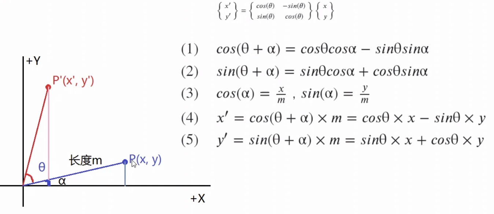
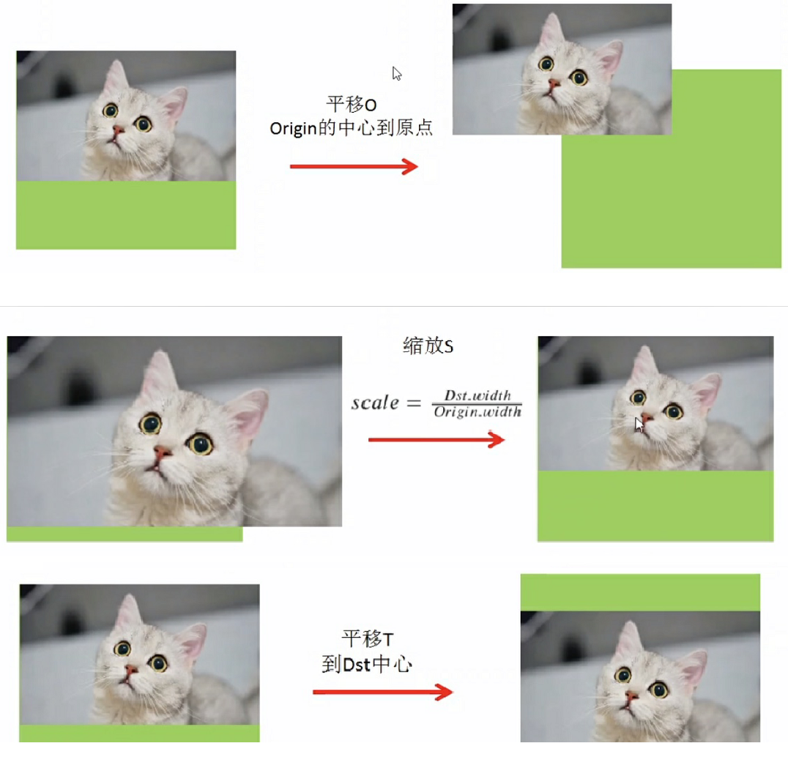
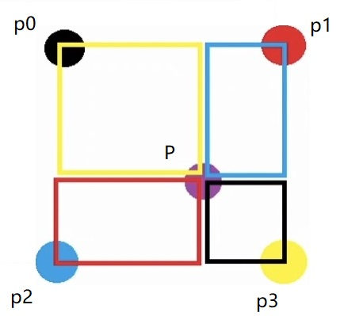
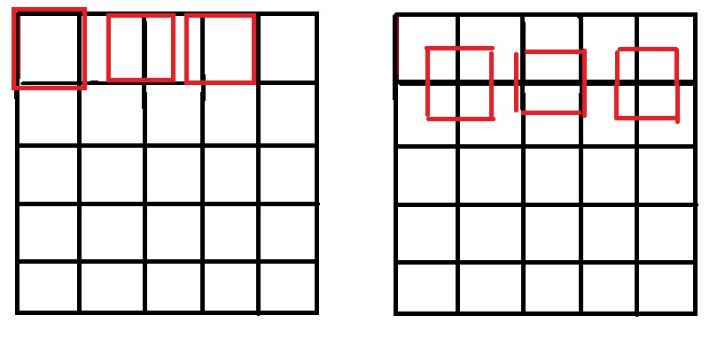

# 2 推理

## 2.1 图像前处理

### 2.1.1 仿射变换

仿射变换（warp affine）指：线性变换+平移

#### 线性变换

线性变换：旋转+比例缩放

几何直观表示：

- 变换前是直线，变换后仍是直线；
- 变换前后，中心不变；
- 变换前后，直线比例不变；

1. 旋转



在opencv坐标系中，y正轴朝下，因此，`θ`取反，顺时针旋转变换矩阵为：（搞不清楚时候根据实际情况，推导一遍）
$$
\left\{ \begin{matrix} x'\\y'\end{matrix} \right\}=\left\{ \begin{matrix} cos(θ) & -sin(θ)\\ sin(θ) & cos(θ)\end{matrix} \right\}\left\{ \begin{matrix} x\\y\end{matrix} \right\}
$$

2. 缩放

$$
\left\{ \begin{matrix} x'\\y'\end{matrix} \right\}=\left\{ \begin{matrix} scale_x & 0\\ 0 & scale_y\end{matrix} \right\}\left\{ \begin{matrix} x\\y\end{matrix} \right\}
$$

3. 旋转+缩放

$$
\left\{ \begin{matrix} x'\\y'\end{matrix} \right\}=\left\{ \begin{matrix} cos(θ) & -sin(θ)\\ sin(θ) & cos(θ)\end{matrix} \right\}\left\{ \begin{matrix} scale_x & 0\\ 0 & scale_y\end{matrix} \right\}\left\{ \begin{matrix} x\\y\end{matrix} \right\}=\left\{ \begin{matrix} cos(θ)*scale_x & -sin(θ)*scale_y\\ sin(θ)*scale_x & cos(θ)*scale_y\end{matrix} \right\}\left\{ \begin{matrix} x\\y\end{matrix} \right\}
$$

#### 平移变换

1. 为什么需要将平移变换转化为矩阵变换？

线性变换可以通过矩阵乘法实现，若平移变换也可以通过矩阵变换，则图像的仿射变换，例如n个旋转、n个缩放、n个平移可以通过一个合并的矩阵变换表示，极大减少计算量；

2. 如何将平移变换转化为矩阵变换？

n维坐标的平移变换无法通过n维矩阵变换得到，通过齐次坐标系，可以通过n+1维矩阵变换，实现n维坐标的平移变换；

平移变换：
$$
\left\{ \begin{matrix} x'\\y'\end{matrix} \right\}=\left\{ \begin{matrix} ox\\oy\end{matrix} \right\}+\left\{ \begin{matrix} x\\y\end{matrix} \right\}=\left\{ \begin{matrix} x+ox\\y+oy\end{matrix} \right\}
$$
矩阵乘法实现平移变换：
$$
\left\{ \begin{matrix} x'\\y'\end{matrix} \right\}=\left\{ \begin{matrix} 1 & 0 & ox\\ 0 & 1 & oy\end{matrix} \right\}\left\{ \begin{matrix} x\\y\\1\end{matrix} \right\}=\left\{ \begin{matrix} x+ox\\y+oy\end{matrix} \right\}
$$

> 齐次指在齐次坐标系中多个点对应于欧式空间中同一个点，因此是齐次

#### 仿射变换

由上可知，线性变换和平移变换均可以表示为矩阵变换，则仿射变换可以通过将线性变换和平移变换矩阵合并，实现一个矩阵`M`完成仿射变换。仿射变换逆变换可以通过`M`的逆矩阵实现；

> 旋转和缩放是无序的，即先旋转后缩放和先缩放后旋转结果一致，但平移是有序的；

1. 缩放矩阵S

$$
\left\{ \begin{matrix} scale_x & 0 & 0\\ 0 & scale_y & 0\\ 0 & 0 & 1\end{matrix} \right\}
$$

2. 旋转矩阵R

$$
\left\{ \begin{matrix} cos(θ) & sin(θ) & 0\\ -sin(θ) & cos(θ) & 0\\ 0 & 0 & 1\end{matrix} \right\}
$$

3. 平移矩阵T

$$
\left\{ \begin{matrix} 1 & 0 & ox\\ 0 & 1 & oy\\ 0 & 0 & 1\end{matrix} \right\}
$$

4. 变换前坐标$P(x,y,1)$，变换后坐标$P'(x',y',w)$，将其先旋转θ，再缩放scale，再平移：$P'=T(S(RP))$，由矩阵乘法结合律可得：$P'=TSRP=MP$

$$
M=\left\{ \begin{matrix} cos(θ)*scale_x & sin(θ)*scale_y & ox\\ -sin(θ)*scale_x & cos(θ)*scale_y & oy\\ 0 & 0 & 1\end{matrix} \right\}
$$

#### 仿射变换三步走

多个线性变换可调换顺序，但平移变换强调顺序，因此在含有平移变换的仿射变换中，遵循三步走可避免错误；

1. 将图像中心平移至原点，此时图像对于坐标轴对称，即平移与线性变换解耦；
2. 线性变换；
3. 将图像中心平移至新的中心；



### 2.1.2 双线性插值



```
# 双线性插值，根据p0~p3像素点值，确定待插值点的像素值；
# 例如p(1.2,1.5)点像素值由p0(1,1),p1(2,1),p2(1,2),p3(2,2)确定

p0 = 1  # (0,0)
p1 = 2  # (1,0)
p2 = 3  # (0,1)
p3 = 4  # (1,1)

pos = (0.6, 0.6)

p0_area = (1 - pos[0]) * (1 - pos[1])
p1_area = pos[0] * (1 - pos[1])
p2_area = (1 - pos[0]) * pos[1]
p3_area = (1 - pos[0]) * (1 - pos[1])

value = p0 * p0_area + p1 * p1_area + p2 * p2_area + p3 * p3_area
print(value)
```

### 2.1.3 编程实现

[<font color=#3333cc>参考：图像推理前处理完整代码</font>](https://github.com/wangzyon/warpfine.git)


#### 双线性插值的中心对齐问题

假设源图像大小为`mxn`，目标图像为`axb`。那么两幅图像的边长比分别为：`m/a`和`n/b`。目标图像的第`(i,j)`个像素点可以通过边长比对应回源图像。其对应坐标为`（i*m/a,j*n/b）`。



当选择左上角为坐标系原点时，最右边和最下边一行的像素并没有参与双线性插值，而且目标图像的计算结果偏左上；因此，需要中心对齐；对齐公式：
$$
x=(i+0.5)*m/a-0.5\\ 
y=(j+0.5)*n/b-0.5
$$
即对于左上角为原点的坐标轴，增加`0.5*scale-0.5`作为修正；

[详细参考：双线性插值算法及需要注意事项](https://www.iteye.com/blog/handspeaker-1545126)

#### Opencv的内存格式

对于三通道图像，内存地址增加顺序为通道->col->row；对于`(x,y)`点像素内存指针为`src+y*col*3+x*3`，x表示图像列， y为图像行；

