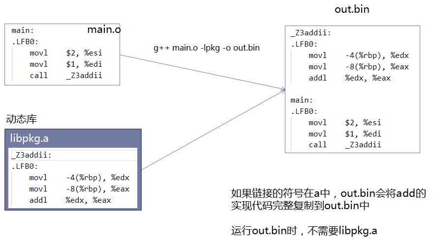

# 1 编译原理

## 1.1 C++内存模型 

#### 虚拟地址空间

Linux系统中一个进程中会分配4G（2^32）虚拟地址空间，可执行文件运行时，符号表虚拟地址映射到进程的虚拟地址空间，CPU通过内存管理单元（MMU）关联虚拟内存和物理内存；

#### 用户空间和内核空间


```cpp
/*
.data    :数据段，存放初始化后，且初始化不为0的数据；
.rodata  :只读数据段；常量字符串；
.text    :已编译程序的机器码；
.bss     :数据段存放未初始化 或初始化为0的数据；.bss数据会被内核置为0，因此全局变量未初始化会是0，而局部变量未初始化值不定；
.heap    :堆内存；
.dll/.so :链接库；
stack    :栈空间；从高地址向低地址增长；
命令行参数和环境变量
*/

int gdata1 = 10;   // 全局变量，已初始化，存放在.data数据段
int gdata2 = 0;    //全局变量，初始化为0，存放在.bss数据段
extern int gdata3; //全局变量，由于是引用，其符号类型是*UND*，undefine未定义，表示引用

static int gdata4 = 11; //静态变量，已初始化，存放在.data数据段
static int gdata5 = 0;  //静态变量，初始化为0，存放在.bss数据段
static int gdata6;      //静态变量，未初始化，存放在.bss数据段

int main() //全局函数，存放在.text段
{
    int a = 12;
    int b = 0;
    int c; //局部变量在编译时，是以指令形式存在.text段，但在运行条指令时，将在栈上开辟栈帧，在stack上；

    static int e = 13; //静态变量，已初始化，存放在.data数据段
    static int f = 0;  //静态变量，初始化为0，存放在.bss数据段
    static int g;      //静态变量，未初始化，存放在.bss数据段
}
```

用户空间是私有的，因此进程间不能直接进行通信；内核空间是共享的，因此，可以通过在内核空间开辟一块内存，作为匿名管道，实现进程间通信。

## 1.2 编译链接原理

### 1.2.1 预编译

预编译完成头文件展开、宏替换、条件编译、去注释等；

预编译指令效果：`g++ -E main.cpp -o main.i`


除了`#program`外带#的都在预编译中处理

```cpp
#program lib  //链接库
#program link //指定程序入口（默认main，可自定义）
```

### 1.2.2 编译

编译完成词法、句法分析、代码优化生成汇编代码；

编译指令效果：`g++ -S main.i -o main.s`


### 1.2.3 汇编

汇编主要有X86和AT&T两种，汇编将汇编代码翻译成二进制机器码，并生成符号表；

汇编指令效果：`g++ -c main.s -o main.o`


```cpp
// main.cpp

int data=20;        // 全局变量，global符号，已初始化，存放在.data数据段
extern int gdata;   //全局变量，global符号，由于是引用，其符号类型是*UND*，undefine未定义，表示引用

static int data2=1; //静态变量，local符号，在.data数据段

int sum(int,int);   //引用，*UND*

int main(){         //main是全局函数，是完整定义的代码段，因此，global符号，存放在.text数据段
    int a=gdata;
    int b=data;
    int ret=sum(a,b);
    return 0;
}

--------------------------------------------------------------------------
(base) root@master01:/data/wangzhiyong/project/bylj# objdump -t main.o //查看二进制重定位的目标文件中的符号表

main.o:     file format elf64-x86-64

SYMBOL TABLE:
0000000000000000 l    df *ABS*	0000000000000000 main.cpp      //l表示local，符号其他文件不可见
0000000000000000 l    d  .text	0000000000000000 .text         //未分配虚拟地址，前面基本都是0000000000
0000000000000000 l    d  .data	0000000000000000 .data
0000000000000000 l    d  .bss	0000000000000000 .bss
0000000000000004 l     O .data	0000000000000004 _ZL5data2
0000000000000000 l    d  .note.GNU-stack	0000000000000000 .note.GNU-stack
0000000000000000 l    d  .eh_frame	0000000000000000 .eh_frame
0000000000000000 l    d  .comment	0000000000000000 .comment
0000000000000000 g     O .data	0000000000000004 data           //g表示global,符号对于其他文件可见；
0000000000000000 g     F .text	0000000000000033 main  
0000000000000000         *UND*	0000000000000000 gdata          //引用，未找到定义，不分配虚拟地址
0000000000000000         *UND*	0000000000000000 _Z3sumii
```

```cpp
//sum.cpp

int gdata=10;

int sum(int a,int b){
    return a+b;
}
-----------------------------------------------------------------------------------
(base) root@master01:/data/wangzhiyong/project/bylj# objdump -t sum.o //查看二进制重定位的目标文件中的符号表

sum.o:     file format elf64-x86-64

SYMBOL TABLE:
0000000000000000 l    df *ABS*	0000000000000000 sum.cpp
0000000000000000 l    d  .text	0000000000000000 .text
0000000000000000 l    d  .data	0000000000000000 .data
0000000000000000 l    d  .bss	0000000000000000 .bss
0000000000000000 l    d  .note.GNU-stack	0000000000000000 .note.GNU-stack
0000000000000000 l    d  .eh_frame	0000000000000000 .eh_frame
0000000000000000 l    d  .comment	0000000000000000 .comment
0000000000000000 g     O .data	0000000000000004 gdata
0000000000000000 g     F .text	0000000000000014 _Z3sumii
```

由于汇编阶段每个文件单独进行，引用符号找不到定义，无法进行符号解析，因此，未分配虚拟地址，虚拟地址均为一堆0串；

> .o文件由ELF文件头和一系列段组成；

### 1.2.4 链接

链接完成二进制重定向文件段的合并、符号解析和符号重定向；

链接指令效果：`g++ main.o sum.o -o out.bin`


```cpp
//ld命令链接所有.o文件，生成a.out -e: entry入口,指定为main符号
ld -e main *.o

//链接完成后查看可执行文件的符号表；
objdump -t a.out

---------------------------------------------------------------------------------------
(base) root@master01:/data/wangzhiyong/project/bylj# objdump -t a.out 

a.out:     file format elf64-x86-64

SYMBOL TABLE:
00000000004000e8 l    d  .text	0000000000000000 .text
0000000000400130 l    d  .eh_frame	0000000000000000 .eh_frame
0000000000600188 l    d  .data	0000000000000000 .data
0000000000000000 l    d  .comment	0000000000000000 .comment
0000000000000000 l    df *ABS*	0000000000000000 main.cpp
000000000060018c l     O .data	0000000000000004 _ZL5data2
0000000000000000 l    df *ABS*	0000000000000000 sum.cpp
000000000040011b g     F .text	0000000000000014 _Z3sumii
0000000000600194 g       .data	0000000000000000 __bss_start
0000000000600188 g     O .data	0000000000000004 data
00000000004000e8 g     F .text	0000000000000033 main
0000000000600190 g     O .data	0000000000000004 gdata
0000000000600194 g       .data	0000000000000000 _edata
0000000000600198 g       .data	0000000000000000 _end
```

#### 符号解析

参与链接的.o文件中的引用符号必须找到符号定义的地方，从参与链接的其他.o文件中找，从参与链接的动态库.so、静态库中找；

- 找不到将报错：未定义的符号；
- 找到多个定义：重定义符号；.data中唯一，全局变量不能重名；

从参与链接的其他.o文件中解析符号：

> 从test.o中获取符号`_Z3addii`定义：


从参与链接的动态库解析符号：


> 动态库是引用方式，不会将符号定义拷贝至out.bin，因此，对于动态库，存在链接时和运行时，两种情况下都需要查询到动态库。

从参与链接静态库解析符号：



> 静态库仅存在链接时，不存在运行时，即可执行文件运行时不需要静态库。

#### 符号重定向

符号解析完成，为每个符号分配虚拟地址，之后，在代码段上，调用符号重新填写正确的虚拟地址；因此，.o文件未经过链接过程的符号解析，符号重定向，符号未分配虚拟地址，无法直接调用执行；

### 1.2.5 路径

#### 编译头文件查询路径

当引用头文件为双引号引用时，在源文件所在目录查询

>  例如：/path/main.cpp中引用头文件#include "my/xxx.h"，则查询头文件路径为/path/my/xxx.h

当引用头文件为尖括号引用时，遵循以下顺序查询：

1. 第一顺序：-I指定的头文件插叙目录；例如`#include <my/xxx.h>`，`g++ main.cpp -Ifolder`，首先查询`/folder/my/xxx.h`;

2. 第二顺序：g++内置路径中查询；例如`/usr/include`,`/usr/local/include`等，可以通过`g++ -print-search-dirs`查看；
3. 第三顺序：系统环境变量中查询，`C_INCLUDE_PATH`，`CPP_INCLUDE_PATH`;

#### 链接时动态库、静态库路径

链接时通过`g++ -lname`，实现链接`libname.so`动态库或者`libname.a`静态库，动态库、静态库查询路径遵循以下顺序：

1. 第一顺序：链接命令中L指定的目录，即`g++ -Lfolder`将在/folder中查询.so或.a文件；
2. 第二顺序：g++内置路径查询；例如`/usr/lib`,`/usr/local/lib`等；
3. 第三顺序：系统环境变量`LIBRARY_PATH`指定的目录；

#### 运行时动态库路径

1. 第一顺序：可执行文件运行目录（非可执行文件所在目录）
2. 第二顺序：可执行文件中存储的rpath，即run path;
3. 第三顺序：系统环境变量`LD_LIBRARY_PATH`, 即list dynamic library path;

若so文件存在上述查询路径下，但运行时提示未找到该so库，是因为该so库依赖的其他库未找到；解决方式：

```bash
# 1.ldd是查询运行时命名，可以查看out.bin运行时动态库是否可找到
ldd out.bin

# 2.定位到NOT FOUND的so库，确定该so是否在运行目录、rpath、LD_LIBRARY_PATH
readelf -d out.bin   # 查看可执行文件的run path

# 3.若so文件存在于上述目录下，则通过ldd查看该so文件依赖，逐个检查其依赖是否在上述三个运行时查询目录下；
ldd xxx.so    # ldd, list dynamic dependencies
```